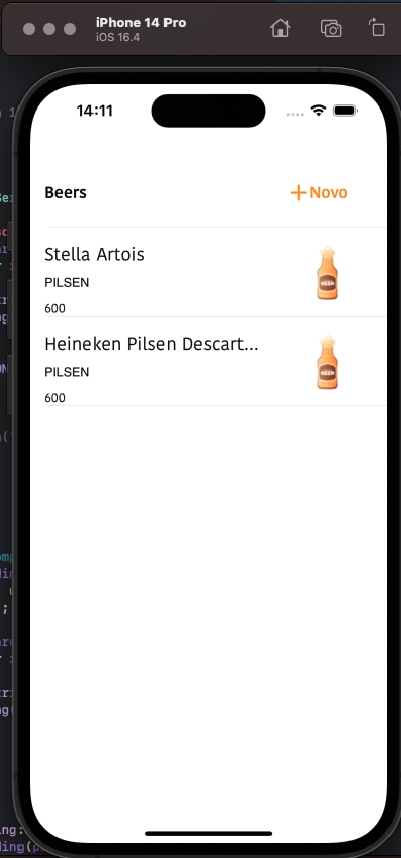
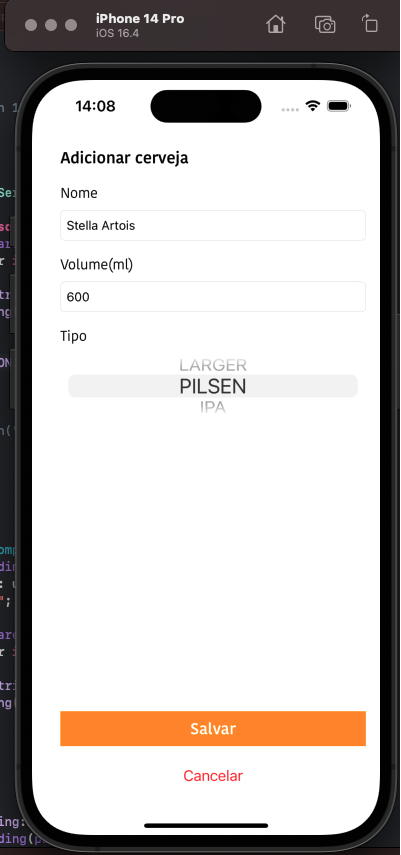

# iBeerstore
#### Experiência, App feito em swift com storyboard, tableView e requisições http:
Trata-se de uma lista de cervejas em uma TableView que é carregada via HTTP, é possível adicionar, editar e remover cervejas dinamicamente
  - Este App console dados da [API BeerStore](https://github.com/Lipe1994/BeerStore) construída com Java usando Spring.

  lista
    

  Criação ou edição
    

